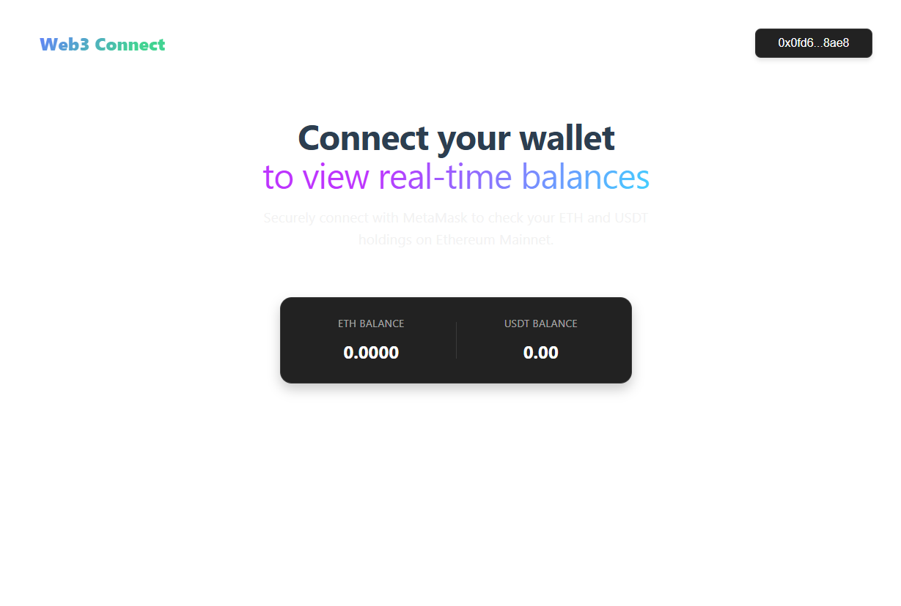

<div style="margin-top:0; padding-top:0" align="center">
<h1 style="margin-top:0">Web3 Connect</h1>
<p>A simple demonstration app for connecting MetaMask and viewing balances.</p>
  


<p>Used technology stack: <b>Vue 3 (Composition API)</b></p>
</div>

## Project Setup

### Install Dependencies
```sh
npm install
```

### Compile and Hot-Reload for Development
```sh
npm run dev
```

### Type-Check, Compile and Minify for Production
```sh
npm run build
```

### Lint with ESLint
```sh
npm run lint
```
